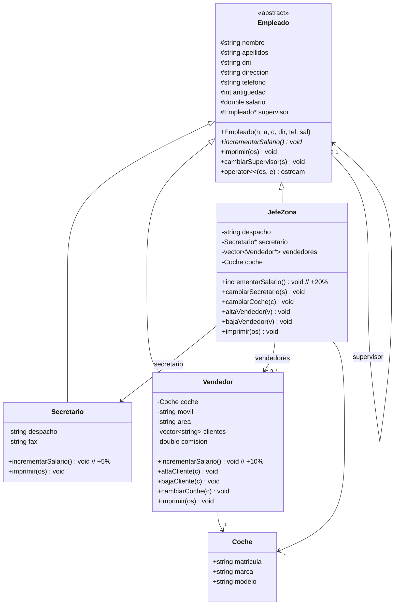

# Diagrama de clases

```mermaid
classDiagram
    class Coche {
        +string matricula
        +string marca
        +string modelo
    }

    class Empleado {
        <<abstract>>
        #string nombre
        #string apellidos
        #string dni
        #string direccion
        #string telefono
        #int antiguedad
        #double salario
        #Empleado* supervisor
        +Empleado(n, a, d, dir, tel, sal)
        +incrementarSalario()* void
        +imprimir(os) void
        +cambiarSupervisor(s) void
        +operator<<(os, e) ostream
    }

    class Secretario {
        -string despacho
        -string fax
        +incrementarSalario() void  // +5%
        +imprimir(os) void
    }

    class Vendedor {
        -Coche coche
        -string movil
        -string area
        -vector~string~ clientes
        -double comision
        +incrementarSalario() void  // +10%
        +altaCliente(c) void
        +bajaCliente(c) void
        +cambiarCoche(c) void
        +imprimir(os) void
    }

    class JefeZona {
        -string despacho
        -Secretario* secretario
        -vector~Vendedor*~ vendedores
        -Coche coche
        +incrementarSalario() void  // +20%
        +cambiarSecretario(s) void
        +cambiarCoche(c) void
        +altaVendedor(v) void
        +bajaVendedor(v) void
        +imprimir(os) void
    }

    Empleado <|-- Secretario
    Empleado <|-- Vendedor
    Empleado <|-- JefeZona
    Empleado --> "0..1" Empleado : supervisor
    JefeZona --> "1" Secretario : secretario
    JefeZona --> "0..*" Vendedor : vendedores
    Vendedor --> "1" Coche
    JefeZona --> "1" Coche
```
