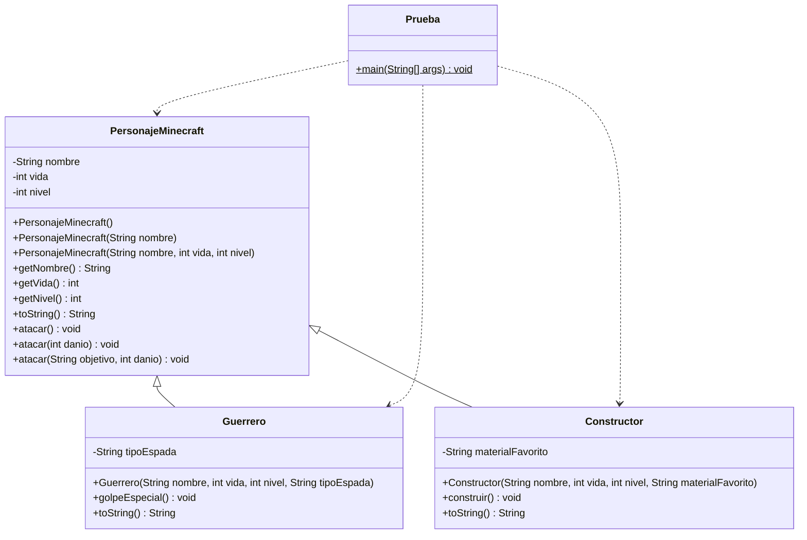

# Diagrama UML

```mermaid
classDiagram
    class PersonajeMinecraft {
        -String nombre
        -int vida
        -int nivel
        +PersonajeMinecraft()
        +PersonajeMinecraft(String nombre)
        +PersonajeMinecraft(String nombre, int vida, int nivel)
        +getNombre() String
        +getVida() int
        +getNivel() int
        +toString() String
        +atacar() void
        +atacar(int danio) void
        +atacar(String objetivo, int danio) void
    }
    class Guerrero {
        -String tipoEspada
        +Guerrero(String nombre, int vida, int nivel, String tipoEspada)
        +golpeEspecial() void
        +toString() String
    }
    class Constructor {
        -String materialFavorito
        +Constructor(String nombre, int vida, int nivel, String materialFavorito)
        +construir() void
        +toString() String
    }
    class Prueba {
        +main(String[] args)$ void
    }
    PersonajeMinecraft <|-- Guerrero
    PersonajeMinecraft <|-- Constructor
    Prueba ..> PersonajeMinecraft
    Prueba ..> Guerrero
    Prueba ..> Constructor
```
